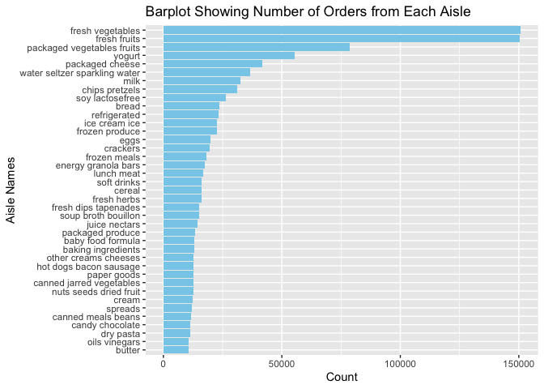
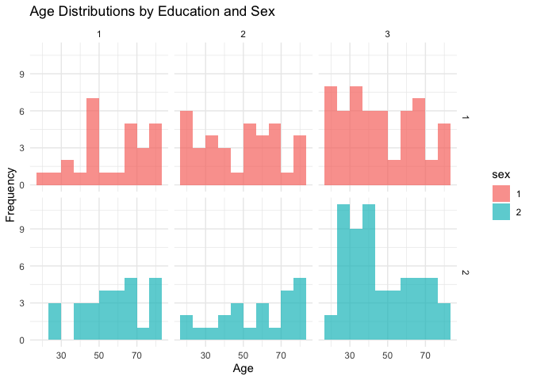
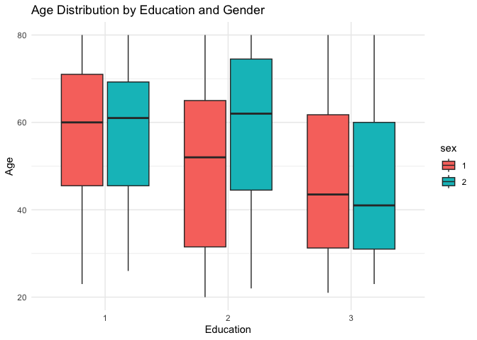
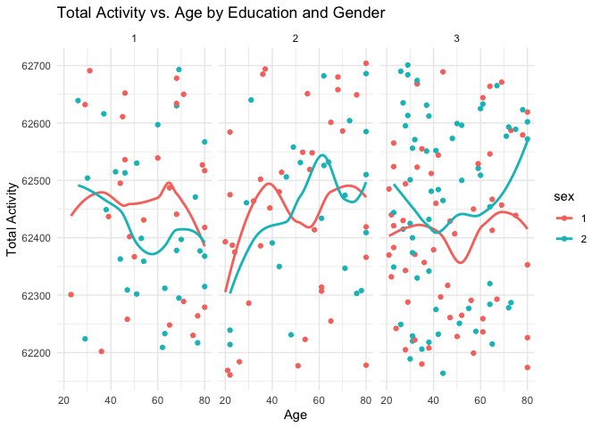
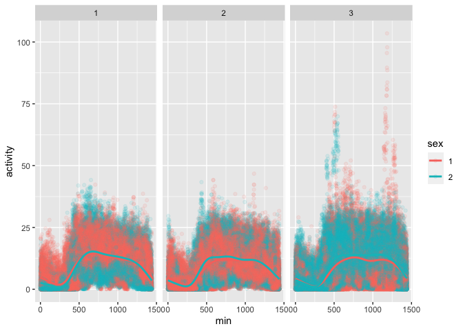

P8105 HW 3
================
Yuki Low (yl5503)
09/15/2023

Loading necessary packages

``` r
library(p8105.datasets)
library(dplyr)
library(ggplot2)
library(tidyr)
library(readr)
library(stringr)
```

**Problem 1**

Loading the Instacart dataset

``` r
data("instacart")
head(instacart)
```

    ## # A tibble: 6 × 15
    ##   order_id product_id add_to_c…¹ reord…² user_id eval_…³ order…⁴ order…⁵ order…⁶
    ##      <int>      <int>      <int>   <int>   <int> <chr>     <int>   <int>   <int>
    ## 1        1      49302          1       1  112108 train         4       4      10
    ## 2        1      11109          2       1  112108 train         4       4      10
    ## 3        1      10246          3       0  112108 train         4       4      10
    ## 4        1      49683          4       0  112108 train         4       4      10
    ## 5        1      43633          5       1  112108 train         4       4      10
    ## 6        1      13176          6       0  112108 train         4       4      10
    ## # … with 6 more variables: days_since_prior_order <int>, product_name <chr>,
    ## #   aisle_id <int>, department_id <int>, aisle <chr>, department <chr>, and
    ## #   abbreviated variable names ¹​add_to_cart_order, ²​reordered, ³​eval_set,
    ## #   ⁴​order_number, ⁵​order_dow, ⁶​order_hour_of_day

The Instacart dataset contains information about online grocery orders
made through the Instacart platform. There are $1384617$ observations in
the Instacart dataset. It includes data on items ordered, the aisle they
belong to, order times, and more. The dataset is structured as a data
frame and consists of several columns, including `order_id`,
`product_id`, `aisle_id`, `aisle`, `product_name`, `order_hour_of_day`,
`order_dow`, and `order_count`.

1.  Using the unique function to gather all of the unique aisle names
    and the length function to count how many unique aisle names there
    are in total
2.  `aisle_df` is a dataset that allows us to see how many orders were
    ordered from each unique aisle
3.  `aisle_df` is arranged in descending order

``` r
num_aisles <- length(unique(instacart$aisle))
aisle_df <- instacart %>% 
  group_by(aisle) %>% 
  summarise(count = n()) %>% 
  arrange(desc(count))
head(aisle_df)
```

    ## # A tibble: 6 × 2
    ##   aisle                          count
    ##   <chr>                          <int>
    ## 1 fresh vegetables              150609
    ## 2 fresh fruits                  150473
    ## 3 packaged vegetables fruits     78493
    ## 4 yogurt                         55240
    ## 5 packaged cheese                41699
    ## 6 water seltzer sparkling water  36617

There are $134$ aisles. The aisles that more items are ordered from are
fresh vegetables ($150609$ orders) and fresh fruits ($150473$ orders).

1.  `aisle_10000` is a subset of the original `aisle_df` and shows us
    only the aisles where there were more than $10000$ orders

``` r
aisle_10000 <- aisle_df %>% 
  filter(count > 10000)

ggplot(aisle_10000, aes(x = reorder(aisle, count), y = count)) +
  geom_bar(stat = "identity", fill = "skyblue") + 
  labs(
    title = "Barplot Showing Number of Orders from Each Aisle",
    x = "Aisle Names",
    y = "Count"
  ) +
  coord_flip()
```

<!-- -->

1.  `baking_ingredients` is a subset of the `instacart` df and looks at
    only the orders from the aisle named “baking ingredients”
2.  The resulting `baking_ingredients` dataframe shows us a product name
    and the number of times that it has been ordered
3.  `baking_ingredients` is ordered in descending order

``` r
baking_ingredients <- subset(instacart, aisle == "baking ingredients")
baking_ingredients <- baking_ingredients %>% 
  group_by(product_name) %>% 
  summarise(count = n()) %>% 
  arrange(desc(count))
head(baking_ingredients)
```

    ## # A tibble: 6 × 2
    ##   product_name                         count
    ##   <chr>                                <int>
    ## 1 Light Brown Sugar                      499
    ## 2 Pure Baking Soda                       387
    ## 3 Cane Sugar                             336
    ## 4 Premium Pure Cane Granulated Sugar     329
    ## 5 Organic Vanilla Extract                327
    ## 6 Organic Unbleached All-Purpose Flour   291

1.  `dog_food_care` is a subset of the `instacart` df and looks at only
    the orders from the aisle named “dog food care”
2.  The resulting `dog_food_care` dataframe shows us a product name and
    the number of times that it has been ordered
3.  `dog_food_care` is ordered in descending order

``` r
dog_food_care <- subset(instacart, aisle == "dog food care")
dog_food_care <- dog_food_care %>% 
  group_by(product_name) %>% 
  summarise(count = n()) %>% 
  arrange(desc(count))
head(dog_food_care)
```

    ## # A tibble: 6 × 2
    ##   product_name                                    count
    ##   <chr>                                           <int>
    ## 1 Snack Sticks Chicken & Rice Recipe Dog Treats      30
    ## 2 Organix Chicken & Brown Rice Recipe                28
    ## 3 Small Dog Biscuits                                 26
    ## 4 Standard Size Pet Waste bags                       25
    ## 5 Organix Grain Free Chicken & Vegetable Dog Food    24
    ## 6 Chicken & Vegetable Snack Sticks for Dogs          23

1.  `packages_veg_fruits` is a subset of the `instacart` df and looks at
    only the orders from the aisle named “packaged vegetables fruits”
2.  The resulting `packages_veg_fruits` dataframe shows us a product
    name and the number of times that it has been ordered
3.  `packages_veg_fruits` is ordered in descending order

``` r
packages_veg_fruits <- subset(instacart, aisle == "packaged vegetables fruits")
packages_veg_fruits <- packages_veg_fruits %>% 
  group_by(product_name) %>% 
  summarise(count = n()) %>% 
  arrange(desc(count))
head(packages_veg_fruits)
```

    ## # A tibble: 6 × 2
    ##   product_name           count
    ##   <chr>                  <int>
    ## 1 Organic Baby Spinach    9784
    ## 2 Organic Raspberries     5546
    ## 3 Organic Blueberries     4966
    ## 4 Seedless Red Grapes     4059
    ## 5 Organic Grape Tomatoes  3823
    ## 6 Organic Baby Carrots    3597

1.  A separate dataframe was created for each of three aisles. Each
    dataframe includes the top three items that were ordered
2.  A column noting which aisle the item belonged to was added to each
    dataframe
3.  The function `rbind` was used to combine the three dataframes into
    one final df
4.  The function `kable` in the package `knitr` was used to format the
    table nicely
5.  The resulting df called `top_3_df` contains the top three items that
    were ordered and which aisle the item was ordered from

``` r
top_baking_ingredients <- head(baking_ingredients[order(baking_ingredients$count, decreasing = TRUE), ], 3)
top_dog_food_care <- head(dog_food_care[order(dog_food_care$count, decreasing = TRUE), ], 3)
top_packaged_vegetables_fruits <- head(packages_veg_fruits[order(packages_veg_fruits$count, decreasing = TRUE), ], 3)

top_baking_ingredients <- top_baking_ingredients %>% 
  mutate(aisle = "baking ingredients")

top_dog_food_care <- top_dog_food_care %>% 
  mutate(aisle = "dog food care")

top_packaged_vegetables_fruits <- top_packaged_vegetables_fruits %>% 
  mutate(aisle = "packaged vegetables fruits")

top_3_df <- rbind(top_baking_ingredients,top_dog_food_care,top_packaged_vegetables_fruits)

knitr::kable(top_3_df)
```

| product_name                                  | count | aisle                      |
|:----------------------------------------------|------:|:---------------------------|
| Light Brown Sugar                             |   499 | baking ingredients         |
| Pure Baking Soda                              |   387 | baking ingredients         |
| Cane Sugar                                    |   336 | baking ingredients         |
| Snack Sticks Chicken & Rice Recipe Dog Treats |    30 | dog food care              |
| Organix Chicken & Brown Rice Recipe           |    28 | dog food care              |
| Small Dog Biscuits                            |    26 | dog food care              |
| Organic Baby Spinach                          |  9784 | packaged vegetables fruits |
| Organic Raspberries                           |  5546 | packaged vegetables fruits |
| Organic Blueberries                           |  4966 | packaged vegetables fruits |

1.  `filtered_orders` is a subset of `instacart` in which we only want
    to look at the information relating to pink lady apples and coffee
    ice cream.
2.  `mean_hour_table` shows us the mean hour of the day that the product
    was ordered on each day of the week
3.  The function `pivot_wider` and `colnames` was used to widen the
    dataframe so that the column names were each day of the week and
    each of the two rows correspond to coffee ice cream and pink lady
    apple respectively

``` r
filtered_orders <- instacart %>%
  filter(product_name %in% c("Pink Lady Apples", "Coffee Ice Cream"))

mean_hour_table <- filtered_orders %>%
  group_by(product_name, order_dow) %>%
  summarize(mean_hour = mean(order_hour_of_day, na.rm = TRUE))
```

    ## `summarise()` has grouped output by 'product_name'. You can override using the
    ## `.groups` argument.

``` r
mean_hour_table <- mean_hour_table %>%
  pivot_wider(names_from = order_dow, values_from = mean_hour) %>%
  arrange(product_name)

colnames(mean_hour_table) <- c("Product", "Sunday", "Monday", "Tuesday", "Wednesday", "Thursday", "Friday", "Saturday")

knitr::kable(mean_hour_table)
```

| Product          |   Sunday |   Monday |  Tuesday | Wednesday | Thursday |   Friday | Saturday |
|:-----------------|---------:|---------:|---------:|----------:|---------:|---------:|---------:|
| Coffee Ice Cream | 13.77419 | 14.31579 | 15.38095 |  15.31818 | 15.21739 | 12.26316 | 13.83333 |
| Pink Lady Apples | 13.44118 | 11.36000 | 11.70213 |  14.25000 | 11.55172 | 12.78431 | 11.93750 |

2.  

*Cleaning the data*

1.  Load the dataset
2.  Clean the dataset column names
3.  We want to subset the data to only include the `topic` of “Overall
    Health”
4.  We want only `response` values from Poor-Excellent
5.  Change the response variable to an ordered variable from Poor to
    Excellent

``` r
library(p8105.datasets)
data("brfss_smart2010")
brfss_smart2010<- brfss_smart2010 %>% 
  janitor::clean_names() %>% 
  subset(topic == "Overall Health") %>% 
  subset(response %in% c("Poor", "Fair", "Good", "Very Good", "Excellent"))

brfss_smart2010$response <- factor(brfss_smart2010$response, levels = c("Poor", "Fair", "Good", "Very Good", "Excellent"), ordered = TRUE)

head(brfss_smart2010)
```

    ## # A tibble: 6 × 23
    ##    year locationabbr locat…¹ class topic quest…² respo…³ sampl…⁴ data_…⁵ confi…⁶
    ##   <int> <chr>        <chr>   <chr> <chr> <chr>   <ord>     <int>   <dbl>   <dbl>
    ## 1  2010 AL           AL - J… Heal… Over… How is… Excell…      94    18.9    14.1
    ## 2  2010 AL           AL - J… Heal… Over… How is… Good        208    33.1    28.2
    ## 3  2010 AL           AL - J… Heal… Over… How is… Fair        107    12.5     9.5
    ## 4  2010 AL           AL - J… Heal… Over… How is… Poor         45     5.5     3.5
    ## 5  2010 AL           AL - M… Heal… Over… How is… Excell…      91    15.6    11  
    ## 6  2010 AL           AL - M… Heal… Over… How is… Good        224    31.2    26.1
    ## # … with 13 more variables: confidence_limit_high <dbl>, display_order <int>,
    ## #   data_value_unit <chr>, data_value_type <chr>,
    ## #   data_value_footnote_symbol <chr>, data_value_footnote <chr>,
    ## #   data_source <chr>, class_id <chr>, topic_id <chr>, location_id <chr>,
    ## #   question_id <chr>, respid <chr>, geo_location <chr>, and abbreviated
    ## #   variable names ¹​locationdesc, ²​question, ³​response, ⁴​sample_size,
    ## #   ⁵​data_value, ⁶​confidence_limit_low

``` r
state_location_counts_2002 <- brfss_smart2010 %>% 
  filter(year == 2002) %>% 
  group_by(locationabbr) %>% 
  summarise(number_of_cities = n_distinct(locationdesc)) %>% 
  filter(number_of_cities >= 7)
state_location_counts_2002
```

    ## # A tibble: 6 × 2
    ##   locationabbr number_of_cities
    ##   <chr>                   <int>
    ## 1 CT                          7
    ## 2 FL                          7
    ## 3 MA                          8
    ## 4 NC                          7
    ## 5 NJ                          8
    ## 6 PA                         10

In 2002, CT, FL, MA, NC, NJ and PA were observed 7 or more locations.

``` r
state_location_counts_2010 <- brfss_smart2010 %>% 
  filter(year == 2010) %>% 
  group_by(locationabbr) %>% 
  summarise(number_of_cities = n_distinct(locationdesc)) %>% 
  filter(number_of_cities >= 7)
head(state_location_counts_2010)
```

    ## # A tibble: 6 × 2
    ##   locationabbr number_of_cities
    ##   <chr>                   <int>
    ## 1 CA                         12
    ## 2 CO                          7
    ## 3 FL                         41
    ## 4 MA                          9
    ## 5 MD                         12
    ## 6 NC                         12

In 2010, CA, CO, FL, MA, MD, NC, NE, NJ, NY, OH, PA, SC, TX, WA were
observed at 7 or more locations.

`excellent_df` is a dataset that is limited to only excellent responses
and contains, the year, the state and the variable named
`avg_data_value` whihc averages the `data_value` across locations within
a state.

``` r
excellent_df <- brfss_smart2010 %>% 
  filter(response == "Excellent") %>% 
  group_by(year, locationdesc) %>%
  summarize(avg_data_value = mean(data_value, na.rm = TRUE))
```

    ## `summarise()` has grouped output by 'year'. You can override using the
    ## `.groups` argument.

``` r
head(excellent_df)
```

    ## # A tibble: 6 × 3
    ## # Groups:   year [1]
    ##    year locationdesc                avg_data_value
    ##   <int> <chr>                                <dbl>
    ## 1  2002 AK - Anchorage Municipality           27.9
    ## 2  2002 AL - Jefferson County                 18.5
    ## 3  2002 AR - Pulaski County                   24.1
    ## 4  2002 AZ - Maricopa County                  21.6
    ## 5  2002 AZ - Pima County                      26.6
    ## 6  2002 CA - Los Angeles County               22.7

``` r
ggplot(excellent_df, aes(x = year, y = avg_data_value, group = locationdesc)) +
  geom_point() + 
  geom_line() +
  labs(
    title = "Average Excellent Responses Over Time by State",
    x = "Year",
    y = "Average Data Value"
  )
```

    ## Warning: Removed 6 rows containing missing values (`geom_point()`).

    ## Warning: Removed 5 rows containing missing values (`geom_line()`).

<!-- -->

`ny_data_2006_2010` is a dataset that is a subset of `brfss_smart_2010`
that filters out only New York and years 2006 or 2010 data_values. The
following is a two panel plot showing, for the years 2006 and 2010, the
distribution of the data_value for responses (“Poor” to “Excellent”)
among locations in New York State.

``` r
ny_data_2006_2010 <- brfss_smart2010 %>%
  filter(locationabbr == "NY" & (year == "2006" | year == "2010")) %>%
  ggplot(aes(x = data_value)) + 
  geom_histogram(binwidth = 3) + 
  facet_grid(year ~response)

ny_data_2006_2010
```

<!-- -->

3.  

Loading the necessary CSV files into R

``` r
accel_df = 
  read_csv("./nhanes_accel.csv") %>%
  janitor::clean_names()
```

    ## Rows: 250 Columns: 1441
    ## ── Column specification ────────────────────────────────────────────────────────
    ## Delimiter: ","
    ## dbl (1441): SEQN, min1, min2, min3, min4, min5, min6, min7, min8, min9, min1...
    ## 
    ## ℹ Use `spec()` to retrieve the full column specification for this data.
    ## ℹ Specify the column types or set `show_col_types = FALSE` to quiet this message.

``` r
covar_df = 
  read_csv("./nhanes_covar.csv") %>%
  janitor::clean_names()
```

    ## New names:
    ## Rows: 254 Columns: 5
    ## ── Column specification
    ## ──────────────────────────────────────────────────────── Delimiter: "," chr
    ## (5): ...1, 1 = male, ...3, ...4, 1 = Less than high school
    ## ℹ Use `spec()` to retrieve the full column specification for this data. ℹ
    ## Specify the column types or set `show_col_types = FALSE` to quiet this message.
    ## • `` -> `...1`
    ## • `` -> `...3`
    ## • `` -> `...4`

``` r
head(covar_df)
```

    ## # A tibble: 6 × 5
    ##   x1    x1_male    x3    x4    x1_less_than_high_school   
    ##   <chr> <chr>      <chr> <chr> <chr>                      
    ## 1 <NA>  2 = female <NA>  <NA>  2 =  High school equivalent
    ## 2 <NA>  <NA>       <NA>  <NA>  3  = More than high school 
    ## 3 <NA>  <NA>       <NA>  <NA>  <NA>                       
    ## 4 SEQN  sex        age   BMI   education                  
    ## 5 62161 1          22    23.3  2                          
    ## 6 62164 2          44    23.2  3

Changing column names and deleting first 4 rows, deleting rows with NA’s

``` r
colnames(covar_df) <- covar_df[4, ]
covar_df <- covar_df[-c(1:4), ]
covar_df<- na.omit(covar_df)
```

Changing sex and education to factor variables, age, BMI and seqn to
integer variables

``` r
covar_df <- 
  covar_df %>% 
  mutate(sex = as.factor(sex)) %>%
  mutate(education = as.factor(education)) %>% 
  mutate(age = as.numeric(age)) %>% 
  mutate(BMI = as.numeric(BMI)) %>% 
  rename(seqn = SEQN) %>% 
  mutate(seqn = as.double(seqn))
```

`summary_table` shows the number of men and women in each education
category.

``` r
summary_table <- covar_df %>%
  group_by(education, sex) %>%
  summarize(count = n()) %>%
  pivot_wider(names_from = sex, values_from = count, names_prefix = "count_")
```

    ## `summarise()` has grouped output by 'education'. You can override using the
    ## `.groups` argument.

``` r
colnames(summary_table)[2:3] <- c("male", "female")

knitr::kable(summary_table)
```

| education | male | female |
|:----------|-----:|-------:|
| 1         |   27 |     28 |
| 2         |   36 |     23 |
| 3         |   56 |     59 |

``` r
age_distribution_plot <- covar_df %>%
  ggplot(aes(x = age, fill = sex)) +
  geom_histogram(position = "identity", alpha = 0.7, bins = 10) +
  facet_grid(sex ~ education) +
  labs(
    title = "Age Distributions by Education and Sex",
    x = "Age",
    y = "Frequency"
  ) +
  theme_minimal()

print(age_distribution_plot)
```

<!-- -->

From the table, we can see that in our dataset, there are slightly more
females than males who have an education level of less than HS, more
males than females who have an education level of HS equivalent, and
slightly more females than males with an education of more than HS.

The distribution of age is approximately left skewed for men with
education level less than high school. The distribution of age is
bimodal for men with education of HS equivalent. The distributuion of
age is approximately uniform for men with education of more than HS.

The distribution of age is approximately uniform for women with
education level less than high school. The distribution of age is left
skewed for women with education of HS equivalent. The distribution of
age is right skewed for women with education of more than HS.

``` r
ggplot(covar_df, aes(x = education, y = age, fill = sex)) +
  geom_boxplot() +
  labs(title = "Age Distribution by Education and Gender", x = "Education", y = "Age") +
  theme_minimal()
```

<!-- -->

We can see from the side-by-side box plots: the median age of men and
women who had an education of less than HS is around 60, the median age
of men is lower than the median age of women for education of HS
equivalent, and the median age of men and women who had an education of
more than HS is around 40.

Creating a total_count variable in the dataframe that accumulates the
min_x values.

``` r
accel_df <- accel_df %>% 
  mutate(total_count = rowSums(select(.,seqn)))
head(accel_df)
```

    ## # A tibble: 6 × 1,442
    ##    seqn  min1  min2  min3  min4   min5   min6  min7   min8    min9  min10  min11
    ##   <dbl> <dbl> <dbl> <dbl> <dbl>  <dbl>  <dbl> <dbl>  <dbl>   <dbl>  <dbl>  <dbl>
    ## 1 62161 1.11  3.12  1.47  0.938 1.60   0.145  2.10  0.509   1.63   1.20   0.947 
    ## 2 62164 1.92  1.67  2.38  0.935 2.59   5.22   2.39  4.90    1.97   3.13   2.77  
    ## 3 62169 5.85  5.18  4.76  6.48  6.85   7.24   6.12  7.48    5.47   6.49   5.14  
    ## 4 62174 5.42  3.48  3.72  3.81  6.85   4.45   0.561 1.61    0.698  2.72   4.85  
    ## 5 62177 6.14  8.06  9.99  6.60  4.57   2.78   7.10  7.25   10.1    7.49   2.72  
    ## 6 62178 0.167 0.429 0.131 1.20  0.0796 0.0487 0.106 0.0653  0.0564 0.0639 0.0909
    ## # … with 1,430 more variables: min12 <dbl>, min13 <dbl>, min14 <dbl>,
    ## #   min15 <dbl>, min16 <dbl>, min17 <dbl>, min18 <dbl>, min19 <dbl>,
    ## #   min20 <dbl>, min21 <dbl>, min22 <dbl>, min23 <dbl>, min24 <dbl>,
    ## #   min25 <dbl>, min26 <dbl>, min27 <dbl>, min28 <dbl>, min29 <dbl>,
    ## #   min30 <dbl>, min31 <dbl>, min32 <dbl>, min33 <dbl>, min34 <dbl>,
    ## #   min35 <dbl>, min36 <dbl>, min37 <dbl>, min38 <dbl>, min39 <dbl>,
    ## #   min40 <dbl>, min41 <dbl>, min42 <dbl>, min43 <dbl>, min44 <dbl>, …

Combining the two dataframs by seqn ID

``` r
combined_df <- covar_df %>% inner_join(accel_df, by = "seqn")
head(combined_df)
```

    ## # A tibble: 6 × 1,446
    ##    seqn sex     age   BMI education  min1  min2  min3  min4   min5   min6  min7
    ##   <dbl> <fct> <dbl> <dbl> <fct>     <dbl> <dbl> <dbl> <dbl>  <dbl>  <dbl> <dbl>
    ## 1 62161 1        22  23.3 2         1.11  3.12  1.47  0.938 1.60   0.145  2.10 
    ## 2 62164 2        44  23.2 3         1.92  1.67  2.38  0.935 2.59   5.22   2.39 
    ## 3 62169 1        21  20.1 2         5.85  5.18  4.76  6.48  6.85   7.24   6.12 
    ## 4 62174 1        80  33.9 3         5.42  3.48  3.72  3.81  6.85   4.45   0.561
    ## 5 62177 1        51  20.1 2         6.14  8.06  9.99  6.60  4.57   2.78   7.10 
    ## 6 62178 1        80  28.5 2         0.167 0.429 0.131 1.20  0.0796 0.0487 0.106
    ## # … with 1,434 more variables: min8 <dbl>, min9 <dbl>, min10 <dbl>,
    ## #   min11 <dbl>, min12 <dbl>, min13 <dbl>, min14 <dbl>, min15 <dbl>,
    ## #   min16 <dbl>, min17 <dbl>, min18 <dbl>, min19 <dbl>, min20 <dbl>,
    ## #   min21 <dbl>, min22 <dbl>, min23 <dbl>, min24 <dbl>, min25 <dbl>,
    ## #   min26 <dbl>, min27 <dbl>, min28 <dbl>, min29 <dbl>, min30 <dbl>,
    ## #   min31 <dbl>, min32 <dbl>, min33 <dbl>, min34 <dbl>, min35 <dbl>,
    ## #   min36 <dbl>, min37 <dbl>, min38 <dbl>, min39 <dbl>, min40 <dbl>, …

``` r
ggplot(combined_df, aes(x = age, y = total_count, color = sex)) +
  geom_point() +
  facet_grid(. ~ education) +
  geom_smooth(method = "loess", se = FALSE) +  # Add a loess curve without a confidence interval
  labs(
    title = "Total Activity vs. Age by Education and Gender",
    x = "Age",
    y = "Total Activity"
  ) +
  theme_minimal()
```

    ## `geom_smooth()` using formula = 'y ~ x'

<!-- -->

Overall: the total activity of male and female with education level less
than HS decreases as age increases, the total activity of male and
female with education level of HS equivalent increases as age increases,
the total activity of male with education level of more than high school
stays about the same as age increases, the total activity of women with
education level of more than high school increases as age increases.

``` r
combined_df <- 
  combined_df %>% 
  pivot_longer(cols = starts_with("min"), names_to = "min", values_to = "activity") %>% 
  mutate(min = str_remove(min, "min")) %>% 
  mutate(min = as.integer(min)) %>% 
  ggplot(aes(x = min, y = activity, color = sex)) +
  geom_point(alpha = .1) +
  geom_smooth(se = F) +
  facet_wrap(~education)

combined_df
```

    ## `geom_smooth()` using method = 'gam' and formula = 'y ~ s(x, bs = "cs")'

<!-- -->

Overall: for all three education levels, as time passes, the activity
increases but slowly starts to decrease again.
